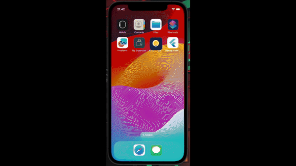

# Quiz App

This project was developed for educational purposes.
There are some topics in the app. You can take the quiz based on the category topic that you have chosen, or you can play it with random questions.

When you click on play or take the quiz from the topic page, you have 20 seconds to answer the question. If you don't choose the answer until the time is over, you will move to the next question.

After you finish doing the quiz, you will navigate to the Score Page.
So, you can see the result (correct answer and incorrect answer).

The project use Flutter SDK Version : `3.13.2`.

It only runs on Android or iOS for better UI.

___

Here is the demo:

___

Thank you 🚀
